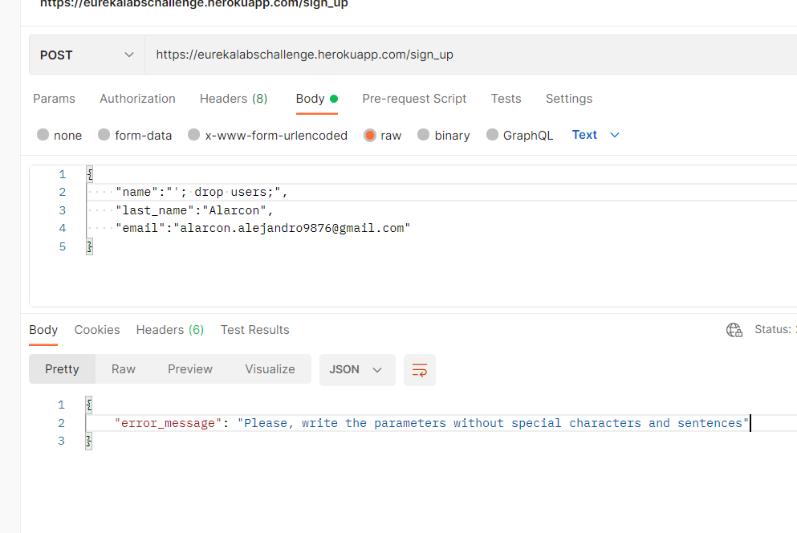
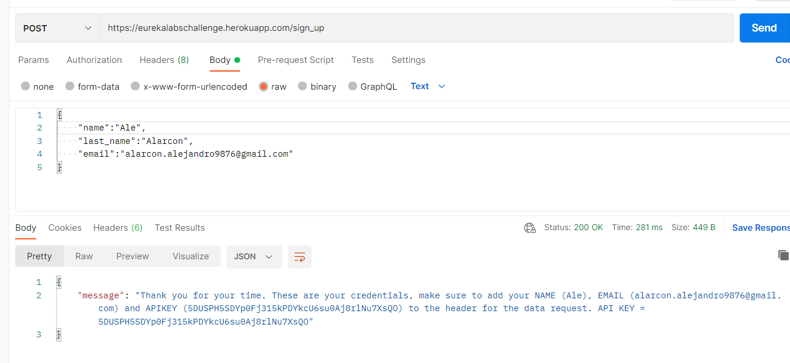
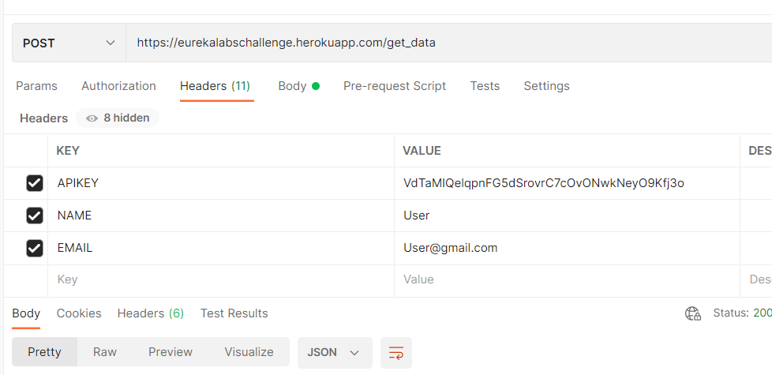
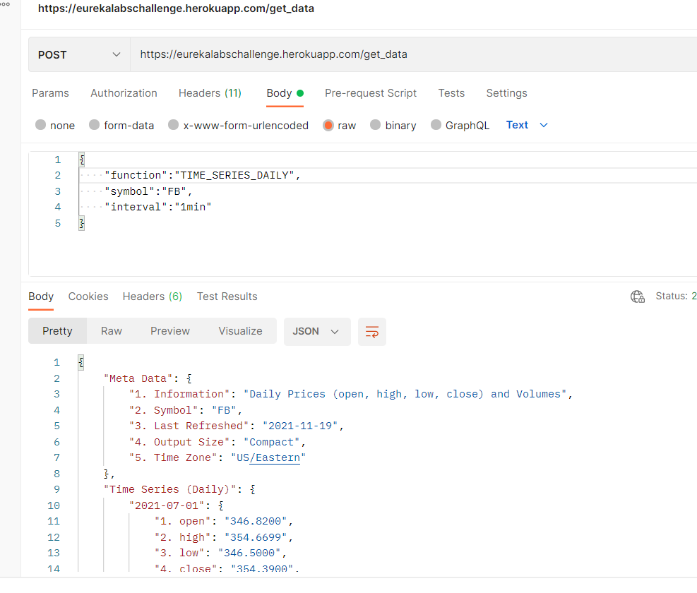

# Stock-Market-API-Service

Documentation API Service

This is a guide on how to use the "Stock Market API Service".

The url of the service is https://eurekalabschallenge.herokuapp.com/

1)
The first step to use the service is to register and get an API KEY.

You have to send a POST request to https://eurekalabschallenge.herokuapp.com/sign_up

Then, in the body you have to add the parameters:
* name
* last_name
* email.
Without special characters or sql injection

This is the correct form
 
After you have sent the request you will receive your credentials to proceed with step 2.

Make sure to save them because you won't be able to refer to them later.

2)
This is the url to query data https://eurekalabschallenge.herokuapp.com/get_data

In the previous step you received:
* name
* email
* API KEY
You have to enter those 3 parameters in the header in this way

The fields must be named exactly NAME. EMAIL, APIKEY.

Then, in the body you have to add at least the following parameters:
* function
* symbol {FB, AAPL, MSFT, GOOGL, AMZN}
* interval {1min, 5min, 15min, 30min, 60min}
For example:

Here you have the documents to know what this API offers https://www.alphavantage.co/documentation/
